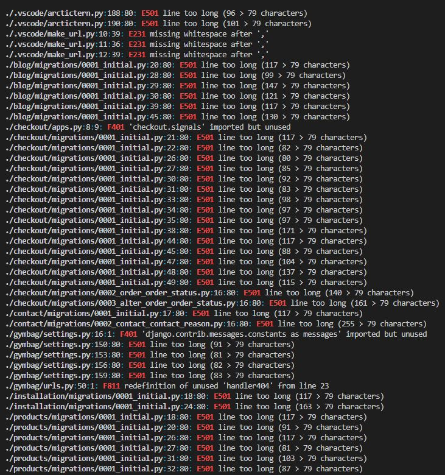

# GymBag

## Introduction
GymBag is a fictional e-commerce fashion retailer based in Ireland.
Founded in September 2022, GymBag specializes in buying clearance stock from manufacturers and selling at discounted prices online.

That this website is for educational purposes only and the credit card payment functionality is not set up to accept real payments.
If testing interactively, feel free to use card details below. Further information can be viewed via [Stripe documentation test page](https://stripe.com/docs/testing)
* 4242424242424242 (Visa)
* Expiration date = Any future date (Example: 12/24)
* CVN = any 3 digits (Example: 132)
* Postcode = any 5 digits (Example: 12345)

## Showcase

### Live Website
A deployed link to the website can be found [here](https://sherryrich-gymbag.herokuapp.com/)

### QR Code

 

  
Click here to see QR Code

  

  

# Table of Contents
- [Table of Contents](#table-of-contents)
- [Introduction](#introduction)
- [UX](#ux-user-experience)
- [Architecture](#architecture)
- [Design](#design)
- [Features](#features)
- [Web Marketing](#web-marketing)
- [Social Media](#social-media)
- [Technologies Used](#technologies-used)
- [Testing](#testing)
- [Deployment](#deployment)
- [Credits](#credits)
- [Acknowledgements](#acknowledgements)

## UX User Experience
### User Stories
Agile Development Process, The MoSCoW method was adopted to approach to prioritizing which project requirements for must have, should have, could have and will not have. Please view [GitHub Issues](https://github.com/sherryrich/gymbag/issues) as well as the [KANBAN board](https://github.com/users/sherryrich/projects/13) used for for this project.

#### As the site creator/admin:
* As the website Administrator I would like to be able to access the Django admin
* As the website Administrator I would like to be able to add, view, edit and delete products
* As the website Administrator I would like to be able to add, view, edit and delete blog posts
* As the website Administrator I want to be able to view / reject pending posts from users before publication

####  As the site user:
* As a website user, I want to be able to instantly understand the main purpose of the site and learn more about the business and products on offer
* I want to be able to register an account
* I want to be able to update details on my account
* I want to be able to register for newsletter
* I want to be able to add products to my shopping bag and update / pusrchase items easily
* I want to be able to checkout securely
* I want to be able to leave comments on all news / blog posts
* I want to be able to Like & unlike on all news / blog posts
* I want to be able to search all products by using the search functionality
* I want to be able to view my order history / my profile
* I want to be able to send messages via the contact form
* I want to be able to send messages via the installation form

### Overall Goals
* Create an e-commerce cloud-hosted Full-Stack web application to sell Gym related products online.
* Allow superusers access to full CRUD (create, read, update and deleted) functionality on blog posts / articles and products respectively.
* To provide users with a targeted product selection and smooth customer experience when shopping on GymBag.

### Strategy
* GymBag primarily is focused on selling B2C products to end users. Habits of the consumers have changed recently and many more consumers than ever before have turned to online shopping versus traditional brick-and-mortar store purchases. This is where GymBag aims to benefit consumers by offering large discounts off the manufacturer’s products for home and commercial exercises equipment.

### Site User / Target Audience / Demographic
* Target market is aimed at anyone in the 20 - 35 years old
* Gym enthusiasts who like to post about their gym routines, lifestyle and diet online
* People looking to be part of the community by posting, sharing & liking articles

### Site Goals
* The site's main purpose is immediately clear
* Simple navigation that allows the user to find information and resources intuitively
* User authentication
* CRUD functionality for superuser(s)

## Architecture
### Database Schema

I created 8 tables for the website. Post, Comment, Contact, installation, order, OrderLineItem, product and UserProfile tables. 

A relational database was created. SQLite was used in development of the website and Postgres via Heroku in production.

The Post table is used by SuperUsers to post blog posts  to the website. It has a Primary Key of ID & a ForeignKey relationship to the Comment table. 
The table also has the following fields, a title, slug (short summary the subject of a post), content, excerpt (short extract), Updated On (date post was updated), Created On (date post was created), status (draft or published) and Likes.

The Comment table is used by users to comment on blog posts. It has the following fields a Primary Key of ID, name, email, body, created on, approved and a ForeignKey to the Post table.

The Contact table is used by users to submit the contact form. It has the following fields a Primary Key of ID, name, email, body & created on (date contact form was submitted) and contact_reason.

The Installation table is used by users to submit the installation query form. It has the following fields a Primary Key of ID, name, email, body & created on (date contact form was submitted) and installation_type.

The Product model contains information about all products listed on the website. It has the following fields a Primary Key of ID, a ForeignKey of category, sku, name, description, has_sizes, price, rating, image_url & image.

The UserProfile table contains information about the user's profile. It has the following fields Primary Key of ID, user, default_phone_number, default_street_address1, default_street_address2, default_town_or_city, default_county, default_postcode & default_country.

The Order model contains all information relating to a customer's order. It has the following fields a Primary Key of ID, order_number, a ForeignKey to the user_profile, full_name, email, phone_number, country, postcode, town_or_city, street_address1, street_address2, county, date, delivery_cost, order_total, grand_total, original_bag, stripe_pid &order_status.

The OrderLineItem table contains infor about an order. It has the following fields a Primary Key of ID, a ForeignKey to the order table, product_size, quantity and lineitem_total.

  
Click here to view Database Schema:

  

  

## Design
### Wireframes
 

  
Click here to view all wireframes both Desktop & mobile:

  
  
  
  
  
  

  
  
  
  
  
  

  

### Navigation
I created a logic flowchart to help organise the site structure. The ERD (entity relationship diagram) helped visually to confirm user roles and the permissions and website structure.

  
Click here to view website navigation:

  

  

### Color Palette

  
Click here to view Color Palette:

  

  

### Typography
Roboto Condensed is the primary font taken from Google Fonts this font was chosen for its largely geometric font which features friendly and open curves. Fall back fonts are Lato, Arial & sans-serif.

## Features
### Existing Features

### Home page
Homepage displays the logo on the left top, search bar in the middle, then my account and card details on the right hand side.
Below that is the main navigation links. There is a H1 heading with "No 1 for gym gear" along with a large background image of weights bar and plates informing users so that the website's purpose is immediately evident to a new user.

### Navigation Bar
The naviation bar has links to all products, clothing, nutrition, equipment, special offers and more. Included in the dropdown for more are the links to About us, gum instatiion, news / blog and ccontact us pages.

### All Products page
The All products page displays all products available. Users can sort by price, rating, name or category. There is a back to top button if users wish to get back to the top easily.

### Product Category pages
Users can search via each category in the various dropdown options for quick navigation.

### Individual Product pages - shopping bag
Individual product pages provides a name, description, price, the quantity selected and update and delete options if superuser is logged in.

### About Us
The about us page informs the user(s) to find brieft information on hen the website was formed and what the website sells.

### Gym Installation page
The Installation page allows potential users contact GymBag regarding potential gym instaallation queries.  Once the form is successfully sent a message is shown to the user to inform the user.

### News / Blog
This feature is used by admin users to display latest news articles and stories to generate inbound traffic to the website organically.

### Contact Us
Feedback and suggestions can be submitted via a form with name, email and body of message and dropdown option, the options available are Retuns, Availabilty, Pricing, Feedback and Other. Once the form is successfully sent a message is shown to the user to inform the user.

### Newsletter sign-up
Newsletter signup form encourging users to enter email address on the homepage for the purposes gathering email addresses for digital marketing campaigns.

### Shopping Cart and Checkout
The Shopping Cart updates with the total value spent and displays a success message along with incentive to increase spend to avail of free delivery over $50.

### User Profile Page
The user profile page displays users contact information along with order history includeing current oder status. This can be edited by the superuser in the admin. Once tthe status is changed this is reflected in realtime for the user. The 3 status options are "Confirmed", "Shipped" and "Cancelled", the default status is "Confirmed" once an order is completed.

Status is changed in admin.

## Admin CRUD pages for Products
### Adding a product as a superuser

### Adding a product - success message

### Reading / viewing the product listed

### Update - product details

### Update - product details - confirmation message

### Delete - product details

### Admin
Admin - Superuser Access

### Footer
The footer contains links to Privacy Policy Terms & Conditions Returns Policy as well as social network links (Facebook, Twitter, Instagram and YouTube) and Copyright information.

### Privacy Policy
GDPR compliant privacy policy informs users about how their data is being collected and processed. It is transparent, concise and easily accessible.

### Returns
A clear returns policy is alos displayed to encourge fist time and repeat customers purchasing.

### Terms & Conditions
Personalized terms and conditions created for GymBag.

### 404 Page
A 404 page was created to handle user navigational errors and give user a quick ink to direct them back to shopping.

## Future Features
* Gift Cards [#28](https://github.com/sherryrich/gymbag/issues/28)
* Customer Reviews [#29](https://github.com/sherryrich/gymbag/issues/29)

## Web Marketing / Marketing Strategies

### SEO - Search Engine Optimization
Google keyword research was used to optmise web pages and content to increase ranking in search engines. Both short-tail & Long-tail keywords are used. The “People also ask” and “Related searches” was also used to identify keywords used.

### Content Marketing
A blog post was created so that the website can create and distribute content material to attract and convert audience into first time customers and repeat customers. The main aim of the blog posts is to build trust and loyalty.

### Social Media Marketing
A facebook business page was set up with the aim of generating growth organically by building a community and encouraging loyalty amongst our target market. The advantage of this is its free and quick to set up and facebook has a large audience and dempgraphic. The site can connect with customers directly via the facebook platform and wider global audience. The main aim of the facebook page iis to build and maintain relationship with target audience. Content created can be spread across different social media platforms. 

I have also included a screen shot below should the facebook business page be removed by facebook.

### Email Marketing
Mailchimp is used to gain new customers and retain existing. Mailchimp enables the business to run and analyse the success of newsletter marketing campaigns. Users who register to receive the newsletter are automatically added to weekly newsletter. This strategy was chosen because its free to set up with the current level of business and can scale quicktly as the business grows therefore increase conversions and generate more revenue for the business. The users who sign up have already visited the website and are more likely to become customers and therefore low cost to generate sales.

## Technologies Used

### Languages Used
* [HTML5](https://developer.mozilla.org/en-US/docs/Web/HTML)
* [CSS3](https://developer.mozilla.org/en-US/docs/Web/CSS)
* [JavaScript](https://www.javascript.com/)
* [Python](https://www.python.org/)

### Frameworks, Libraries & Programs Used
* [Amazon S3](https://aws.amazon.com/s3/) service offered by Amazon Web Services that provides object storage through a web service interface.
* [amiresponsive](http://ami.responsivedesign.is/) to see how responsive the site is on different devices.
* [Balsamiq](https://balsamiq.com/) was used to create the Wireframes.
* [Bootstrap](https://getbootstrap.com/docs/4.6/getting-started/introduction/) v4.6 was used to help build responsive, mobile-first design.
* [Color-hex](https://www.color-hex.com/) once I identified the colors I wanted I used color-hex to generate the palette.
* [Django](https://www.djangoproject.com/) free and open-source, Python-based web framework that follows the model–template–views architectural pattern.
* [Font Awesome](https://fontawesome.com/) was used for icons for aesthetic and UX purposes on the buttons.
* [Git](https://git-scm.com/) was used for version control by utilizing the Gitpod terminal to commit to Git and Push to GitHub.
* [GitHub](https://github.com/) GitHub is used to store the projects code after being pushed from Git.
* [Gitpod](https://www.gitpod.io/) An online IDE linked to the GitHub repository used to write my code.
* [Google Chrome Dev tools](https://developer.chrome.com/docs/devtools/) for debugging.
* [Google Fonts](https://fonts.google.com/about) for typography.
* [Google Lighthouse](https://developers.google.com/web/tools/lighthouse) used for audits to measure the quality of web pages.
* [Google Keyword Planner](https://ads.google.com/aw/keywordplanner/home?)
* [Heroku](https://www.heroku.com/) used to deploy this app, a cloud platform as a service supporting several programming languages.
* [Pexels](https://www.pexels.com/) Images for this project were sourced from Pexels.
* [Privacy Policy Generator](https://www.privacypolicygenerator.info/) Free Privacy Policy Generator.
* [Stripe]() Integrated with Stripe to faciliate online payments.
* [SQLite](https://www.sqlite.org/index.html) database used in local development was a SQLLite database.
* [Terms and Conditions Generator](https://www.termsandconditionsgenerator.com/) Free terms and conditions generator.
* [Unsplash](https://unsplash.com/) Images for this project were sourced from Unsplash.
* [WAVE](https://wave.webaim.org/extension/) Browser Extension testing.
* [Wordtracker](https://www.wordtracker.com/)
* [a11y](https://color.a11y.com/) Color Contrast Accessibility Validator.

## Testing
### Validation Testing
### Lighthouse Report

  

  
Checked color contrast analysis accessibility

  

  
 

### The W3C Markup Validator
### W3C CSS Validator

  

  
Checked using W3C CSS Validator ensuring there were no errors or warnings present. Click here to see the W3C CSS Validator result: 

  

  
 

### flake8

  

  
The website pep8online.com is currently down so flake8 was run in the terminal. Click here to see the result: 

  

  
 

### Color Contrast Accessibility Validator

  

  
Checked color contrast analysis accessibility. Click here to see the W3C CSS Validator result: 

  

  
 

### Manual Testing
### More manual testing scanerios and results
| Feature | Test  | Expected Result | Actual Result |
| -------------| ----- | ----- | :----: |
| GymBag logo  | Selecting GymBag logo on homepage |  directs user back to homepage |  Pass |
| Selecting each navvbar link shows users dropdown options  |  Pass |
| Selecting ALL for each dropdown option brings user to all for each category page  |  Pass |
| Sort By price, rating, name and category options reflects results accordingly on page  |  Pass |
| Selecting About Us directs user to /about/ page |  Pass |
| Selecting Show Now on about us page directs user to /products/ page |  Pass |
| Selecting Gym Installation directs user to /installation/ page |  Pass |
| Sumbitting details in form on /installation/ page sucesfully sends message to admin|  Pass |
| Selecting News / Blog directs user to /blogs/ page |  Pass |
| Selecting News articles directs user to particluar article page |  Pass |
| If logged in as a user I can leave a comment on News articles |  Pass |
| If logged in as a user I can like News articles |  Pass |
| Click on the pagination links "next" and "prev" at the bottom of the news page returns results of the next page (example /?page=2) |  Pass |
| Selecting contact directs user to /contact page  |  Pass |
| Filling in form on /contact page requires name, email and body and contact reason selected to send to Django admin  |  Pass |
| Contact form successfully sends data to Django admin as expected  |  Pass |
| Selecting Register Up directs user to /accounts/signup/ page |  Pass |
| Selecting Login directs user to /accounts/login/ page  |  Pass |
| Using the search box in navbar and entering a search returns expected result  |  Pass |
| Selecting the back to top box on the products pages brings the user back to the top  |  Pass |
| Using the search box in navbar and entering a no results search returns error message and shows all products  |  Pass |
| Registering as a new user and entering form validation works |  Pass |
| Logging in as superuser / admin |  Pass |
| "successfully signed in as (user name)" message shown to user |  Pass |
| When logged in as superuser / admin you can see product management page |  Pass |
| Adding a new product on the product managment page sucesffuly adds product |  Pass |
| Creating a new blog / news article in Django admin reflects on the front end. |  Pass |
| As a user I can see the blog / news article on the front end. |  Pass |
| Editing an existing blog / news article in Django admin reflects change on the front end. |  Pass |
| Deleting a blog / news article in Django admin removes article on the front end. |  Pass |
| Confirmation message that post is "waiting for approval" shown to user |  Pass |
| As admin I can view and publish articles |  Pass |
| Updating a post as the author |  Pass |
| Posting a new article requires appropriate fields to be filled in |  Pass |
| If posting a new product and no image is selected then the default image is used |  Pass |
| Deleting a product as admin |  Pass |
| Confirmation message of deletion is shown |  Pass |
| Users not permitted to access create/update/deleate products or articles if they dont have access permission ie SQL Injection attacks |  Pass |
| Logging out as a user / admin prompts "are you sure" message |  Pass |
| "You have signed out" message shows to user when successfully signed out |  Pass |
| Logging out as a user / admin directs user to homepage |  Pass |
| Clicking on the social media icons in the footer open the link in a new tab |  Pass |
| Clicking on the Privacy Policy link in the footer diverts user to the /privacy/ page |  Pass |
| Clicking on the Terms and Conditions link in the footerdiverts user to the /terms/ page |  Pass |
| Clicking on the Returns Policy link in the footer diverts user to the /returns/ page |  Pass |

### Responsiveness Browser Compatibility

|  | Chrome | Firefox | Edge | Safari | Pass/Fail |
| ------------- |-------------| -----|  ---------- |  -----| :----: |
| Expected Appearance   | yes | yes  | yes  | yes | Pass |
| Expected Layout   | yes | yes  | yes  | yes | Pass |

## Bugs / Errors encountered during development
* “can’t open file ‘manage.py’: [Errno 2] No such file or directory”. Reason why was there is a character missing character in the command used for starting the project
 [View here](https://github.com/sherryrich/gymbag/blob/main/docs/bug1.JPG)
* Incorrectly named the file mobile_top_header.html [View here](https://github.com/sherryrich/gymbag/blob/main/docs/bug2.JPG)
* Needed to have pillow installed to use the image field - pip3 install pillow [View here](https://github.com/sherryrich/gymbag/blob/main/docs/bug3.JPG)
* Dopdown results were not displaying because I had comma seperated when it should have been underscore [View here](https://github.com/sherryrich/gymbag/blob/main/docs/bug4.JPG)
* Typo in both dumbells and kettlebells caused products not to display [View here](https://github.com/sherryrich/gymbag/blob/main/docs/bug5.JPG)
* Includes folder in the wrong location [View here](https://github.com/sherryrich/gymbag/blob/main/docs/bug6.JPG)
* Gitpod, online resource glitch - always a good idea to push regularly [View here](https://github.com/sherryrich/gymbag/blob/main/docs/bug7.JPG)
* Must create app before adding name of app to installed_apps in settings.py [View here](https://github.com/sherryrich/gymbag/blob/main/docs/bug8.JPG)
* Missed closing bracked in settings.py [View here](https://github.com/sherryrich/gymbag/blob/main/docs/bug9.JPG)
* Webhook wasn’t displaying order in the terminal. resolved by making the port public by clicking on the lock icon. [View here](https://github.com/sherryrich/gymbag/blob/main/docs/bug10.JPG) - [View here](https://github.com/sherryrich/gymbag/blob/main/docs/bug11.JPG)
* Spotted typo error in checkout - admin.py [View here](https://github.com/sherryrich/gymbag/blob/main/docs/bug12.JPG) - [View here](https://github.com/sherryrich/gymbag/blob/main/docs/bug13.JPG)
* Updated webhook handler url in strip to match the change in url on Girpod locally - then the webhooks started to process stransactions sucesfully again.
* Comments in the code arent allowed in json [View here](https://github.com/sherryrich/gymbag/blob/main/docs/bug14.JPG)
* Typo in template litteral didn’t display, should be lowercase p {{ products }} [View here](https://github.com/sherryrich/gymbag/blob/main/docs/bug15.JPG)
* When I created duplicate of products.html and edited I should have edited it to "product_detail.html" and not products_detail.html"  [View here](https://github.com/sherryrich/gymbag/blob/main/docs/bug16.JPG)
* If still logged in as /admin this can cause issues locally. When I logged out and back in I was able to see expected local version.
* didn’t append the webhook url in Stripe with '/' [View here](https://github.com/sherryrich/gymbag/blob/main/docs/bug17.JPG) & [View here](https://github.com/sherryrich/gymbag/blob/main/docs/bug18.JPG)
* issues deploying - followed steps advised on slack and worked [View here](https://github.com/sherryrich/gymbag/blob/main/docs/bug19.JPG)
* Typo in settings.py [View here](https://github.com/sherryrich/gymbag/blob/main/docs/bug20.JPG)
* CSS - back to top was behind fixed bottom footer, initally I used z-index but felt this looked wrong so just moved it up above the footer [View here](https://github.com/sherryrich/gymbag/blob/main/docs/bug21.JPG) 
* Needed to run a migration on the Postgres DB just with a Heroku prefix and it will affect the Postgres DB on Heroku instead of local SQLite one.
"heroku run python3 manage.py makemigrations" & "heroku run python3 manage.py migrate" resolved this. [View here](https://github.com/sherryrich/gymbag/blob/main/docs/bug22.JPG)

## Unfixed Bugs
* When running "python3 -m flake8" in the terminal and excluding cscode, migrations & settings there are 2 remaining issues detailed below.
* "./gymbag/urls.py:50:1: F811 redefinition of unused 'handler404' from line 23". This is as per code institute instructions [View here](https://github.com/sherryrich/gymbag/blob/main/docs/404_error.JPG) 
* ./checkout/apps.py:8:9: F401 'checkout.signals' imported but unused. This is as per code institute Boutique Ado instructions 
[Code Institute Solutions](https://github.com/Code-Institute-Solutions/boutique_ado_v1/blob/250e2c2b8e43cccb56b4721cd8a8bd4de6686546/checkout/apps.py)
* tHE CON
## Deployment

* This project was developed using a GitPod workspace. The code was committed to Git and pushed to GitHub using the terminal.

* Log in to [Heroku](https://id.heroku.com/login) or create an account
* On the main page click New and Create New App
* Note: new app name must be unique
* Next select your region, I chose Europe.
* Click Create App button
* Click in resources and select Heroku Postgres database
* Click Reveal Config Vars and add new config "SECRET_KEY"
* Click Reveal Config Vars and add new config "DISABLE_COLLECTSTATIC = 1"
* The next page is the project’s Deploy Tab. Click on the Settings Tab and scroll down to Config Vars
* Next, go to Buildpack section click Add Buildpack select python and Save Changes
* Scroll to the top of the page and choose the Deploy tab
* Select Github as the deployment method
* Confirm you want to connect to GitHub
* Search for the repository name and click the connect button
* Scroll to the bottom of the deploy page and select the preferred deployment type
* Click either Enable Automatic Deploys for automatic deployment when you push updates to Github

### Final Deployment 

* Create a runtime.txt `python-3.8.14`
* Create a Procfile `web: gunicorn gymbag.wsgi:application`
* When development is complete change the debug setting to: `DEBUG = False` in settings.py
* In Heroku settings, delete the config vars for `DISABLE_COLLECTSTATIC = 1`

### Forking This Project

* Open [GitHub](https://github.com/sherryrich/gymbag)
* Find the 'Fork' button at the top right of the page
* Once you click the button the fork will be in your repository

### Cloning This Project

* Clone this project by following the steps:

* Open [GitHub](https://github.com/sherryrich/gymbag)
* You will be provided with three options to choose from, HTTPS, SSH or GitHub CLI, click the clipboard icon in order
to copy the URL
* Once you click the button the fork will be in your repository
* Open a new terminal
* Change the current working directory to the location that you want the cloned directory
* Type 'git clone' and paste the URL copied in step 3
* Press 'Enter' and the project is cloned

## Credits

* Code Institute - [Boutique Ado](https://learn.codeinstitute.net/courses/course-v1:CodeInstitute+EA101+2021_T1/courseware/eb05f06e62c64ac89823cc956fcd8191/3adff2bf4a78469db72c5330b1afa836/) -  Walkthrough
* Code Institute - [Hello Django](https://learn.codeinstitute.net/courses/course-v1:CodeInstitute+FST101+2021_T1/courseware/dc049b343a9b474f8d75822c5fda1582/121ef050096f4546a1c74327a9113ea6/) -  Walkthrough
* Code Institute - [I think therefore I blog](https://learn.codeinstitute.net/courses/course-v1:CodeInstitute+FST101+2021_T1/courseware/b31493372e764469823578613d11036b/fe4299adcd6743328183aab4e7ec5d13/
) - Django blog project Walkthrough
* Codemy.com Database Tables With Django - [YouTube](https://youtu.be/z5e_8FgKZig)
* Codemy.com Delete a Blog Post - Django - [YouTube](https://youtu.be/8NPOwmtupiI)
* Corey Schafer Python Django Tutorial [YouTube](https://www.youtube.com/c/Coreyms)
* Create A Simple Blog With Python and Django [YouTube](https://youtu.be/B40bteAMM_M)
* The Web Developer Bootcamp 2002 [Udemy](https://www.udemy.com/course/the-web-developer-bootcamp/)
* How to Use GitHub for Automated Kanban Project Management [YouTube](https://www.youtube.com/watch?v=YVFa5VljCDY)
* Style Django Forms With Bootstrap 
 [YouTube](https://www.youtube.com/watch?v=6-XXvUENY_8)
 * More Django Styling  
 [YouTube](https://www.youtube.com/watch?v=uJp4PaDkux0)

## Acknowledgements
* To create this website, I relied on material covered in the Full Stack Development course by Code Institute.
* I also sourced information and help from a variety of sources such as Slack Community Channels, Udemy, W3Schools, MDN and YouTube for Online Web Tutorials and resources.
* Martina Terlevic for reviewing my work and providing valuable feedback and advice.

This project is for educational use only and was created for the Code Institute Module.

Created by Richard Sherry 😊