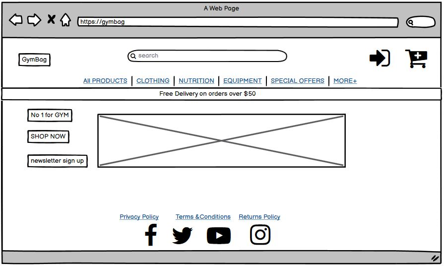

# GymBag

## Introduction
GymBag is a fictional e-commerce fashion retailer based in Ireland.
Founded in September 2022, GymBag specializes in buying clearance stock from manufacturers and selling at discounted prices online.

## Showcase

### Live Website
A deployed link to the website can be found [here](https://sherryrich-gymbag.herokuapp.com/)

# Table of Contents
- [Table of Contents](#table-of-contents)
- [Introduction](#introduction)
- [UX](#ux-user-experience)
- [Architecture](#architecture)
- [Design](#design)
- [Features](#features)
- [Web Marketing](#web-marketing)
- [Social Media](#social-media)
- [Technologies Used](#technologies-used)
- [Testing](#testing)
- [Deployment](#deployment)
- [Credits](#credits)
- [Acknowledgements](#acknowledgements)

## UX User Experience
### User Stories
#### As the site creator/admin:
####  As the site user:
### Overall Goals
### Strategy

## Architecture
### Database Schema

## Design
### Wireframes
### Wireframes
 

  
Click here to view all wireframes both Desktop & mobile:

  
  
  
  
  
  

  
  
  
  
  
  

  

### Navigation
I created a logic flowchart to help organise the site structure. The ERD (entity relationship diagram) helped visually to confirm user roles and the permissions and website structure.

  
Click here to view website navigation:

  

  

### Color Palette

  
Click here to view Color Palette:

  

  

### Typography
Roboto Condensed is the primary font taken from Google Fonts this font was chosen for its largely geometric font which features friendly and open curves. Fall back fonts are Lato, Arial & sans-serif.

## Features
### Existing Features
### Future Features

## Web Marketing

## Social Media

## Technologies Used

### Languages Used
* [HTML5](https://developer.mozilla.org/en-US/docs/Web/HTML)
* [CSS3](https://developer.mozilla.org/en-US/docs/Web/CSS)
* [JavaScript](https://www.javascript.com/)
* [Python](https://www.python.org/)

### Frameworks, Libraries & Programs Used
* [Amazon S3](https://aws.amazon.com/s3/) service offered by Amazon Web Services that provides object storage through a web service interface.
* [amiresponsive](http://ami.responsivedesign.is/) to see how responsive the site is on different devices.
* [Balsamiq](https://balsamiq.com/) was used to create the Wireframes.
* [Bootstrap](https://getbootstrap.com/docs/4.6/getting-started/introduction/) v4.6 was used to help build responsive, mobile-first design.
* [Color-hex](https://www.color-hex.com/) once I identified the colors I wanted I used color-hex to generate the palette.
* [Django](https://www.djangoproject.com/) free and open-source, Python-based web framework that follows the model–template–views architectural pattern.
* [Font Awesome](https://fontawesome.com/) was used for icons for aesthetic and UX purposes on the buttons.
* [Git](https://git-scm.com/) was used for version control by utilizing the Gitpod terminal to commit to Git and Push to GitHub.
* [GitHub](https://github.com/) GitHub is used to store the projects code after being pushed from Git.
* [Gitpod](https://www.gitpod.io/) An online IDE linked to the GitHub repository used to write my code.
* [Google Chrome Dev tools](https://developer.chrome.com/docs/devtools/) for debugging.
* [Google Fonts](https://fonts.google.com/about) for typography.
* [Google Lighthouse](https://developers.google.com/web/tools/lighthouse) used for audits to measure the quality of web pages.
* [Heroku](https://www.heroku.com/) used to deploy this app, a cloud platform as a service supporting several programming languages.
* [Pexels](https://www.pexels.com/) Images for this project were sourced from Pexels.
* [Stripe]() Integrated with Stripe to faciliate online payments.
* [SQLite](https://www.sqlite.org/index.html) database used in local development was a SQLLite database.
* [Unsplash](https://unsplash.com/) Images for this project were sourced from Unsplash.
* [WAVE](https://wave.webaim.org/extension/) Browser Extension testing.
* [a11y](https://color.a11y.com/) Color Contrast Accessibility Validator.

## Testing
### Validation Testing
### Lighthouse Report
### The W3C Markup Validator
### W3C CSS Validator
### W3C CSS Validator
### PEP8 online
### JSHint
### Color Contrast Accessibility Validator
### Manual Testing

## Bugs / Errors encountered during development

## Deployment

## Credits

## Acknowledgements
